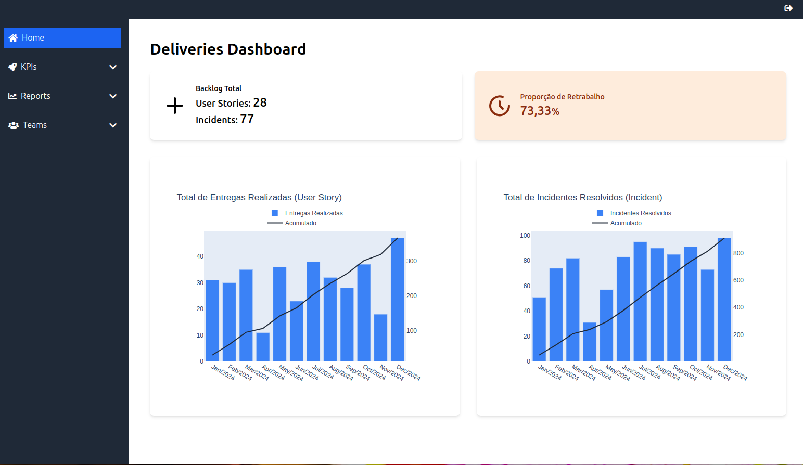
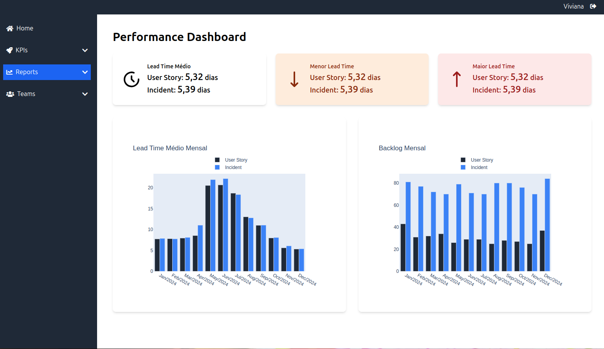

# **DeliverTrack**





## **Overview**

### English
**DeliverTrack** is a cutting-edge solution for building, managing, and visualizing data pipelines. Tailored for modern business demands and technical leaders like CTOs and directors, it leverages technologies such as **Django** and **Plotly** to create a robust system capable of processing, transforming, and analyzing large data volumes with ease.

A standout feature of this project is its complete **ETL (Extract, Transform, Load)** pipeline, powered by **PostgreSQL**, **Pandas**, and **Requests**. This system extracts data directly from the **Azure DevOps API**, performs advanced transformations, and loads structured data into a centralized database. It also includes dynamic dashboards built with **Plotly**, offering interactive insights and detailed analytics. Best practices in modularity, security, and code organization ensure a scalable and reliable platform.

### Portuguese
O **DeliverTrack** é uma solução de ponta para construção, gerenciamento e visualização de pipelines de dados. Projetado para atender às demandas de negócios modernos e líderes técnicos como CTOs e diretores, integra tecnologias como **Django** e **Plotly** para criar um sistema robusto, capaz de processar, transformar e analisar grandes volumes de dados com eficiência.

Um dos principais diferenciais é a implementação de um pipeline completo de **ETL (Extract, Transform, Load)**, utilizando **PostgreSQL**, **Pandas** e **Requests**. O sistema extrai dados diretamente da **API do Azure DevOps**, realiza transformações complexas e carrega os dados estruturados em um banco centralizado. Também inclui dashboards dinâmicos construídos com **Plotly**, proporcionando insights interativos e análises detalhadas. Boas práticas de modularidade, segurança e organização de código garantem uma plataforma escalável e confiável.

---

## **Architecture and Technologies**

### English
The project employs a scalable architecture that integrates multiple technologies for seamless end-to-end data management and visualization:

#### Data Pipeline:
- **Azure DevOps API**: Extracts real-time data from repositories, work items, and project metrics.
- **PostgreSQL**: Serves as a centralized database for structured data.
- **Pandas**: Performs streamlined data transformations.
- **Requests**: Handles API integration for fetching and posting data.

#### Visualization:
- **Plotly**: Creates interactive dashboards showcasing KPIs like backlog analysis, rework proportion, and delivery trends.
- **Django Templates**: Renders a user-friendly interface.

#### Application Framework:
- **Django**: Handles user authentication, permission management, and core backend operations.
- **Docker**: Ensures consistent development and production environments.

### Portuguese
O projeto utiliza uma arquitetura escalável que integra diversas tecnologias para um gerenciamento e visualização de dados eficiente de ponta a ponta:

#### Pipeline de Dados:
- **API do Azure DevOps**: Extrai dados em tempo real de repositórios, work items e métricas de projetos.
- **PostgreSQL**: Atua como banco centralizado para dados estruturados.
- **Pandas**: Realiza transformações ágeis de dados.
- **Requests**: Integração com APIs externas para manipulação de dados.

#### Visualização:
- **Plotly**: Cria dashboards interativos com KPIs como análise de backlog, proporção de retrabalho e tendências de entrega.
- **Templates Django**: Renderiza uma interface amigável.

#### Framework de Aplicação:
- **Django**: Gerencia autenticação, permissões de usuários e operações principais do backend.
- **Docker**: Garante consistência nos ambientes de desenvolvimento e produção.

---

## **Key Features**

### English
- **Backlog Analysis**: Gain insights into the current state of work items across types.
- **Rework Proportion**: Highlights error-related backlogs, helping identify inefficiencies.
- **Interactive Dashboards**: Visualize KPIs dynamically with Plotly.
- **Scalability**: Designed to handle large datasets and complex workflows.

### Portuguese
- **Análise de Backlog**: Detalha o estado atual dos itens de trabalho por tipo.
- **Proporção de Retrabalho**: Destaca backlogs relacionados a erros, ajudando a identificar ineficiências.
- **Dashboards Interativos**: Explore KPIs dinamicamente com Plotly.
- **Escalabilidade**: Projetado para lidar com grandes volumes de dados e fluxos complexos.

---

## **How to Run**

### English
1. Clone this repository:
   ```bash
   git clone https://github.com/your-repository/delivertrack.git
   ```
2. Build the Docker image:
   ```bash
   docker build -t delivertrack .
   ```
3. Run the Docker container:
   ```bash
   docker run -p 8000:8000 delivertrack
   ```
4. Access the application at: [http://localhost:8000](http://localhost:8000)

### Portuguese
1. Clone este repositório:
   ```bash
   git clone https://github.com/seu-repositorio/delivertrack.git
   ```
2. Construa a imagem Docker:
   ```bash
   docker build -t delivertrack .
   ```
3. Execute o container Docker:
   ```bash
   docker run -p 8000:8000 delivertrack
   ```
4. Acesse a aplicação em: [http://localhost:8000](http://localhost:8000)

---

## **Middlewares: Propósito e Habilitação | Middlewares: Purpose and Enabling**

Os middlewares do **DeliverTrack** adicionam funcionalidades essenciais para segurança, auditoria e controle de acesso. Eles são configuráveis e podem ser habilitados conforme as necessidades do sistema.

### **Middlewares Disponíveis | Available Middlewares**

#### **1. LoginAuditMiddleware**
**PT**: Registra eventos de login e logout, incluindo informações como IP, navegador utilizado e nome do usuário. Ideal para auditoria e segurança.

**EN**: Logs login and logout events, including details such as IP, browser used, and username. Ideal for auditing and security purposes.

- **Habilitação | Enabling:**
  Adicione o middleware em `MIDDLEWARE` no `settings.py`:
  ```python
  MIDDLEWARE = [
      ...
      'authentication.middleware.LoginAuditMiddleware',
  ]

#### **2. SingleSessionMiddleware**
**PT**: Garante que um usuário autenticado tenha apenas uma sessão ativa, encerrando sessões anteriores automaticamente.

**EN**: Ensures an authenticated user has only one active session, automatically terminating previous sessions.

- **Habilitação | Enabling:**
  Adicione o middleware em `MIDDLEWARE` no `settings.py`:
  ```python
  MIDDLEWARE = [
      ...
      'authentication.middleware.SingleSessionMiddleware',
  ]

#### **3. GeoIPAuthMiddleware**
**PT**: Restringe logins com base na localização geográfica, permitindo apenas acessos de países autorizados (ex.: Brasil).

**EN**: Restricts logins based on geographical location, allowing access only from authorized countries (e.g., Brazil).

- **Habilitação | Enabling:**
  Adicione o middleware em `MIDDLEWARE` no `settings.py`:
  ```python
  MIDDLEWARE = [
      ...
      'authentication.middleware.GeoIPAuthMiddleware',
  ]

---


## License

This project is licensed under the MIT License - see the [LICENSE](./LICENSE) file for details.
